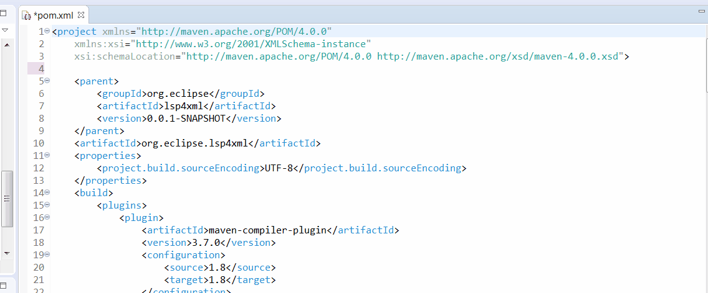

XML Language Server (LemMinX)
===========================
[](https://repo.eclipse.org/content/repositories/lemminx-releases/org/eclipse/lemminx/org.eclipse.lemminx/)
[](https://download.eclipse.org/lemminx/releases/)
[](https://ci.eclipse.org/lemminx/job/lemminx/job/main/)
[](https://github.com/eclipse/lemminx/actions/workflows/codeql-analysis.yml?query=branch%3Amain)
[](https://github.com/eclipse/lemminx/blob/main/LICENSE)

**LemMinX** is a XML language specific implementation of the [Language Server Protocol](https://github.com/Microsoft/language-server-protocol)
and can be used with any editor that supports the protocol, to offer good support for the **XML Language**. The server is based on:

 * [Eclipse LSP4J](https://github.com/eclipse/lsp4j), the Java binding for the Language Server Protocol.
 * Xerces to manage XML Schema validation, completion and hover

Features
--------------

* [textDocument/codeAction](https://microsoft.github.io/language-server-protocol/specification#textDocument_codeAction).
* [textDocument/completion](https://microsoft.github.io/language-server-protocol/specification#textDocument_completion).
* [textDocument/documentHighlight](https://microsoft.github.io/language-server-protocol/specification#textDocument_documentHighlight).
* [textDocument/documentLink](https://microsoft.github.io/language-server-protocol/specification#textDocument_documentLink).
* [textDocument/documentSymbol](https://microsoft.github.io/language-server-protocol/specification#textDocument_documentSymbol).
* [textDocument/foldingRanges](https://microsoft.github.io/language-server-protocol/specification#textDocument_foldingRange).
* [textDocument/formatting](https://microsoft.github.io/language-server-protocol/specification#textDocument_formatting).
* [textDocument/hover](https://microsoft.github.io/language-server-protocol/specification#textDocument_hover).
* [textDocument/rangeFormatting](https://microsoft.github.io/language-server-protocol/specification#textDocument_rangeFormatting)
* [textDocument/rename](https://microsoft.github.io/language-server-protocol/specification#textDocument_rename).

See screenshots in the [Features docs](./docs/Features.md).

See the [changelog](CHANGELOG.md) for the latest release.


Demo
--------------



Get started
--------------
* Clone this repository
* Open the folder in your terminal / command line
* Run `./mvn clean verify` (OSX, Linux) or `mvnw.cmd clean verify` (Windows)
* After successful compilation you can find the resulting `org.eclipse.lemminx-uber.jar` in the folder `org.eclipse.lemminx/target`

Developer
--------------

To debug the XML LS you can use XMLServerSocketLauncher:

1. Run the XMLServerSocketLauncher in debug mode (e.g. in eclipse)
2. Connect your client via socket port. Default port is 5008, but you can change it with start argument `--port` in step 1

Client connection example using Theia and TypeScript:

```js
let socketPort = '5008'
console.log(`Connecting via port ${socketPort}`)
const socket = new net.Socket()
const serverConnection = createSocketConnection(socket,
    socket, () => {
        socket.destroy()
    });
this.forward(clientConnection, serverConnection)
socket.connect(socketPort)
```

Generating a native binary:
---------------------------------
To generate a native binary:
- [Install GraalVM 20.2.0](https://www.graalvm.org/docs/getting-started/#install-graalvm)
- In a terminal, run `gu install native-image`
- Execute a Maven build that sets the flag `native`: `./mvn clean package -Dnative -DskipTests`
  - On Linux, compile with `./mvn clean package -Dnative -DskipTests -Dgraalvm.static=--static`
    in order to support distributions that don't use `glibc`, such as Alpine Linux
- It will generate a native binary in `org.eclipse.lemminx/target/lemminx-{os.name}-{architecture}-{version}`

OS specific instructions:
- __Linux__:
  - Make sure that you have installed the static versions of the C++ standard library
    - For instance, on Fedora Linux, install `glibc-static`, `libstdc++-static`, and `zlib-static`
- __Windows__:
  - When installing native-image, please note that `gu` is an existing alias in PowerShell.
  Remove the alias with `Remove-Item alias:gu -Force`, refer to `gu` with the absolute path, or use `gu` under `cmd.exe`.
  - Make sure to run the Maven wrapper in the "Native Tools Command Prompt".
  This command prompt can be obtained through installing the Windows SDK or Visual Studio, as
  mentioned in the [GraalVM installation instructions](https://www.graalvm.org/docs/getting-started-with-graalvm/windows/).

`native-image` Development Instructions:
- Reflection:
  - If you need to use reflection to access a private field/method, simply register the field/methods that you access in `reflect-config.json`
  - If you need to parse some JSON using Gson, make sure to register the fields and methods of the class that you are parsing into in `reflect-config.json`
    - This needs to be done recursively, for all classes that it has member variables of, including `enum`s
    - Settings are all deserialized, so whenever a setting is added, make sure to register the classes
  - Manually test the binary and check the logs for reflection errors/NPEs

Maven coordinates:
------------------

Here are the Maven coordinates for lemminx (replace the `X.Y.Z` version with the [latest release](https://repo.eclipse.org/content/repositories/lemminx-releases)):
```xml
<dependency>
    <groupId>org.eclipse.lemminx</groupId>
    <artifactId>org.eclipse.lemminx</artifactId>
    <version>X.Y.Z</version>
    <!-- classifier:uber includes all dependencies -->
    <classifier>uber</classifier>
</dependency>
```

for Gradle:
```
compile(group: 'org.lemminx', name: 'org.eclipse.lemminx', version: 'X.Y.Z', classifier: 'uber')
```

You will have to reference the Maven repository hosting the dependency you need. E.g. for Maven, add this repository to your pom.xml or settings.xml :
```xml
<repository>
  <id>lemminx-releases</id>
  <url>https://repo.eclipse.org/content/repositories/lemminx-releases/</url>
  <snapshots>
    <enabled>false</enabled>
  </snapshots>
  <releases>
    <enabled>true</enabled>
  </releases>
</repository>
```

And if you want to consume the SNAPSHOT builds instead:
```xml
<repository>
  <id>lemminx-snapshots</id>
  <url>https://repo.eclipse.org/content/repositories/lemminx-snapshots/</url>
  <releases>
    <enabled>false</enabled>
  </releases>
  <snapshots>
    <enabled>true</enabled>
  </snapshots>
</repository>
```

Verify 3rd Party Libraries
----------------------------

_Currently generating the IP Log report requires a Java Runtime Environment (JRE) >= 11._

Run `./mvn clean verify -Pverify-iplog` to generate a report for the 3rd party libraries used by this project. See the [Eclipse Project Handbook](https://www.eclipse.org/projects/handbook/#ip-license-tool) for further details.


Clients
-------

Here are some clients consuming this XML Language Server:

 * Eclipse IDE with [Wild Web Developer](https://github.com/eclipse/wildwebdeveloper) and [m2e](https://www.eclipse.org/m2e/)
 * VSCode with [vscode-xml](https://github.com/redhat-developer/vscode-xml)
 * Theia with [theia-xml](https://github.com/theia-ide/theia-xml-extension)
 * [Spring Tools 4](https://github.com/spring-projects/sts4) - re-using the XML parser for Spring-specific analysis and content-assist
 * Vim/Neovim with [coc-xml](https://github.com/fannheyward/coc-xml)
 * Emacs with [lsp-mode](https://github.com/emacs-lsp/lsp-mode)


Extensions
----------

The XML Language Server can be extended to provide additional validation and assistance. Read the [LemMinX-Extensions docs](./docs/LemMinX-Extensions.md) for more information
