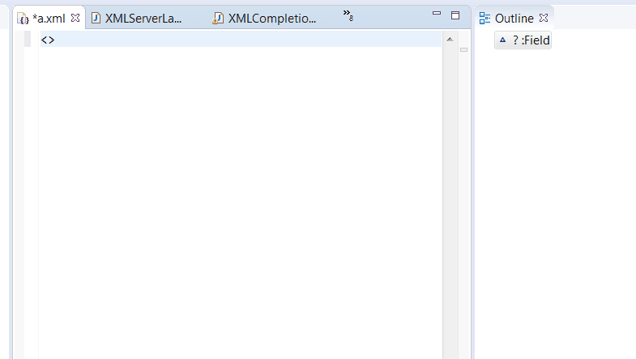

XML Language Server (lsp4xml)
===========================

[](http://travis-ci.org/angelozerr/lsp4xml)

The **lsp4xml** is a XML language specific implementation of the [Language Server Protocol](https://github.com/Microsoft/language-server-protocol)
and can be used with any editor that supports the protocol, to offer good support for the **XML Language**. The server is based on:

 * [Eclipse LSP4J](https://github.com/eclipse/lsp4j), the Java binding for the Language Server Protocol.
 * Xerces to manage XML Schema validation, completion and hover

Features
--------------

* [textDocument/codeAction](https://microsoft.github.io/language-server-protocol/specification#textDocument_codeAction).
* [textDocument/completion](https://microsoft.github.io/language-server-protocol/specification#textDocument_completion).
* [textDocument/documentHighlight](https://microsoft.github.io/language-server-protocol/specification#textDocument_documentHighlight).
* [textDocument/documentLink](https://microsoft.github.io/language-server-protocol/specification#textDocument_documentLink).
* [textDocument/documentSymbol](https://microsoft.github.io/language-server-protocol/specification#textDocument_documentSymbol).
* [textDocument/foldingRanges](https://microsoft.github.io/language-server-protocol/specification#textDocument_foldingRange).
* [textDocument/formatting](https://microsoft.github.io/language-server-protocol/specification#textDocument_formatting).
* [textDocument/hover](https://microsoft.github.io/language-server-protocol/specification#textDocument_hover).
* [textDocument/rangeFormatting](https://microsoft.github.io/language-server-protocol/specification#textDocument_rangeFormatting)
* [textDocument/rename](https://microsoft.github.io/language-server-protocol/specification#textDocument_rename).

See screenshots in the [wiki](https://github.com/angelozerr/lsp4xml/wiki/Features).

See the [changelog](CHANGELOG.md) for the latest release.

Extension
--------------

The XML Language Server is extensible with plugin kind (with SPI). Here existings extensions:

 * content model to provide completion, validation, hover based on XML Schema.
 * emmet to provide completion based on Emmet.

Demo
--------------



Get started
--------------
* Clone this repository
* Open the folder in your terminal / command line
* Run `./mvnw clean verify` (OSX, Linux) or `mvnw.cmd clean verify` (Windows)
* After successful compilation you can find the resulting `org.eclipse.lsp4xml-uber.jar` in the folder `org.eclipse.lsp4xml/target`

Developer
--------------

To debug the XML LS you can use XMLServerSocketLauncher:

1. Run the XMLServerSocketLauncher in debug mode (e.g. in eclipse)
2. Connect your client via socket port. Default port is 5008, but you can change it with start argument `--port` in step 1

Client connection example using Theia and TypeScript:

```js
let socketPort = '5008'
console.log(`Connecting via port ${socketPort}`)
const socket = new net.Socket()
const serverConnection = createSocketConnection(socket,
    socket, () => {
        socket.destroy()
    });
this.forward(clientConnection, serverConnection)
socket.connect(socketPort)
```

Maven coordinates:
------------------

Here are the Maven coordinates for lsp4xml (replace the `X.Y.Z` version with the [latest release](https://bintray.com/beta/#/lsp4xml/releases/lsp4xml)):
```xml
<dependency>
    <groupId>org.lsp4xml</groupId>
    <artifactId>org.eclipse.lsp4xml</artifactId>
    <version>X.Y.Z</version>
    <!-- classifier:uber includes all dependencies -->
    <classifier>uber</classifier>
</dependency>
```

for Gradle:
```
compile(group: 'org.lsp4xml', name: 'org.eclipse.lsp4xml', version: 'X.Y.Z', classifier: 'uber')
```

You will have to reference the Maven repository hosting the dependency you need. E.g. for Maven, add this repository to your pom.xml or settings.xml :
```xml
<repository>
  <id>lsp4xml-releases</id>
  <url>https://dl.bintray.com/lsp4xml/releases</url>
  <snapshots>
    <enabled>false</enabled>
  </snapshots>
  <releases>
    <enabled>true</enabled>
  </releases>
</repository>
```
or P2 repository: [https://dl.bintray.com/lsp4xml/p2/`<VERSION>`](https://dl.bintray.com/lsp4xml/p2/) 


And if you want to consume the SNAPSHOT builds instead:
```xml
<repository>
  <id>lsp4xml-snapshots</id>
  <url>https://oss.jfrog.org/artifactory/libs-snapshot</url>
  <releases>
    <enabled>false</enabled>
  </releases>
  <snapshots>
    <enabled>true</enabled>
  </snapshots>
</repository>
```
or P2 repository:
[https://lsp4xml.jfrog.io/lsp4xml/generic-local/p2/lsp4xml/`<VERSION>`](https://lsp4xml.jfrog.io/lsp4xml/generic-local/p2/lsp4xml/)

Clients
-------

Here are some clients consuming this XML Language Server:

 * Eclipse IDE with [Wild Web Developer](https://github.com/eclipse/wildwebdeveloper)
 * VSCode with [vscode-xml](https://github.com/redhat-developer/vscode-xml)
 * Theia with [theia-xml](https://github.com/theia-ide/theia-xml-extension)
 * [Spring Tools 4](https://github.com/spring-projects/sts4) - re-using the XML parser for Spring-specific analysis and content-assist
 * Vim/Neovim with [coc-xml](https://github.com/fannheyward/coc-xml)

 ---

 
 
