# Features

## Validation

 * Syntax XML validation
 
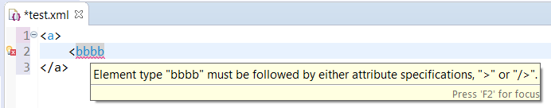
 
 * with extension (XML Schema, DTD validation)

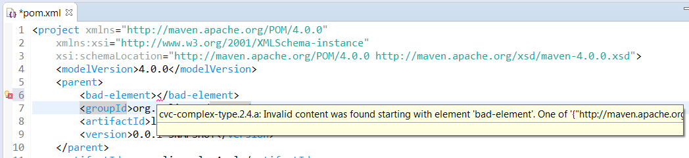

## Completion

Completion is available for:

 * close element
 
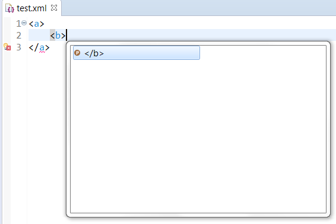
 
 * #region and #endregion
 
TODO -> https://github.com/angelozerr/lsp4xml/issues/54
 
 * with extensions:
 
   * based on XML Schema
   
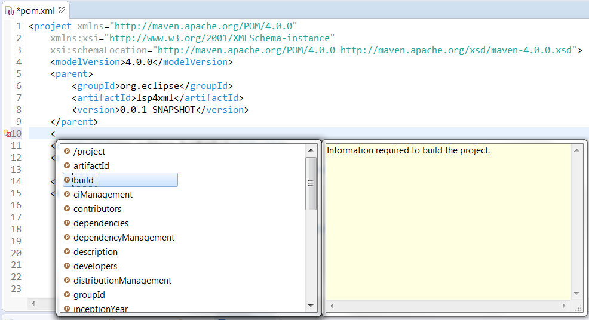   

## Document Symbols

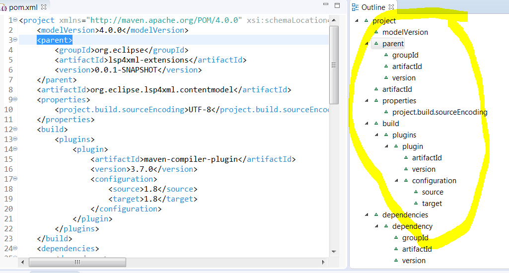

## Highlight

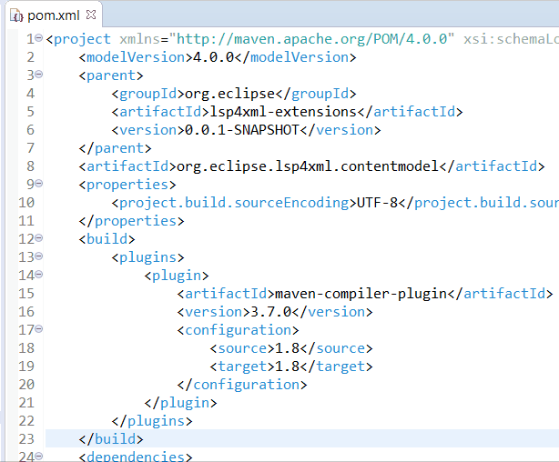

## Rename

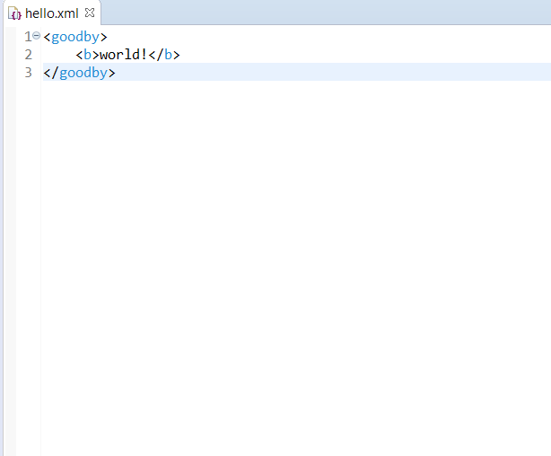

## Folding

XML folding of tag is done:

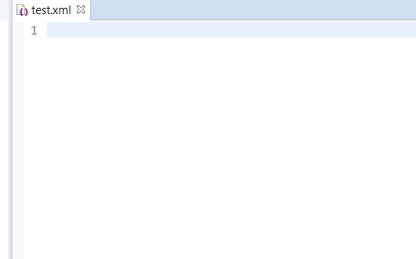

You can use too `<!-- #region -->`, `<!-- #endregion -->` to manage your custom folding ranges:

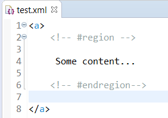

## Hover

Only with extension (like XML Schema)

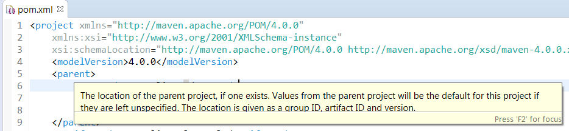

## Format

Here a demo with XML formating:

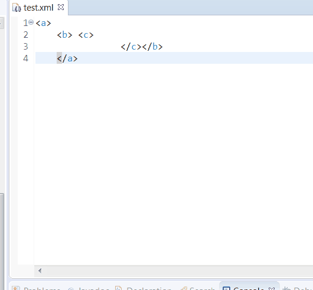

## Code Action

Here a demo with close tag fix:

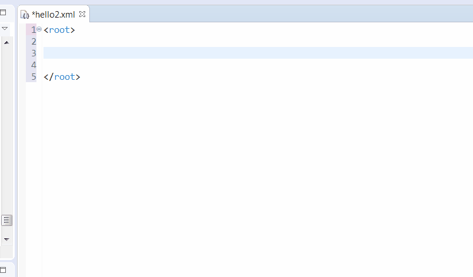